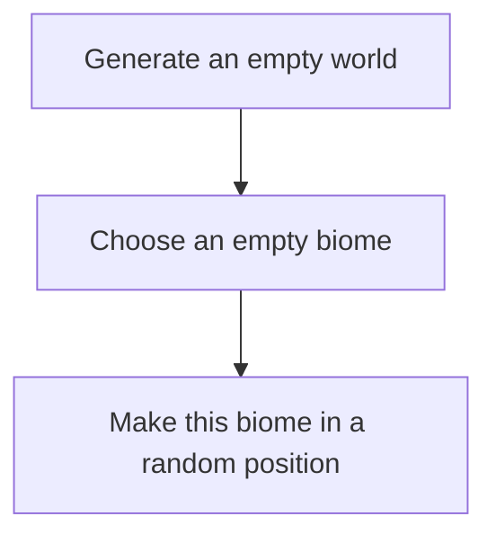

# Algorithm - Rework

---

## A. Schema

```mermaid
graph TD;
    genEmpty[Generate an empty world] --> choRdm[Choose an empty biome]
    choRdm[Choose an empty biome] --> mkBiome[Make this biome in a random position]
```

